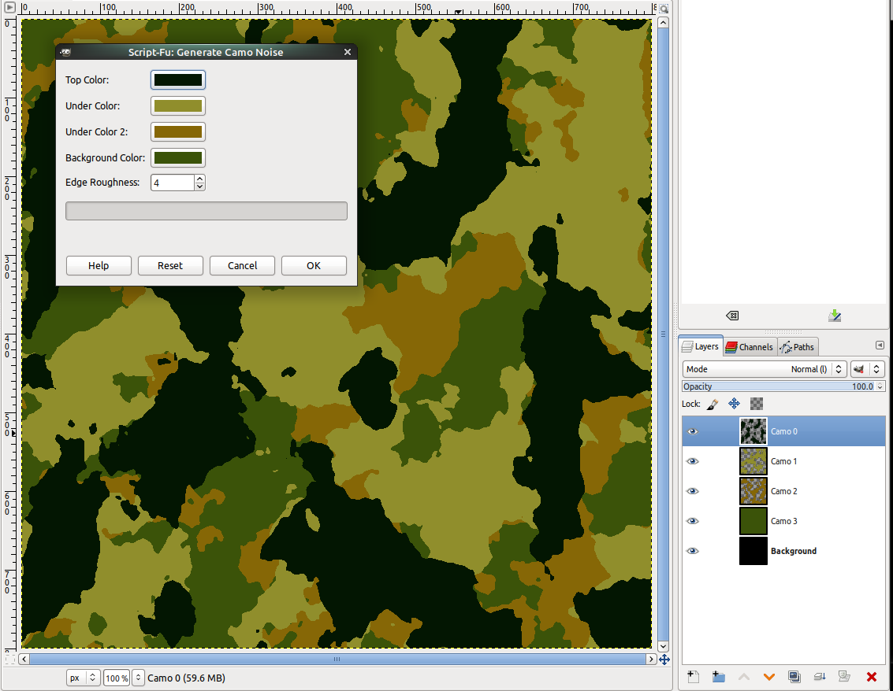

# gimp-camo

This generates some camo patterns (4 colors) for GIMP.
You should open a new blank image then run it.
In Linux this goes in ~/.comfig/GIMP/2.10/scripts but you'll have to adjust to your scripts folder location.

Here is a sample showing the generated layers in the colors you select.

